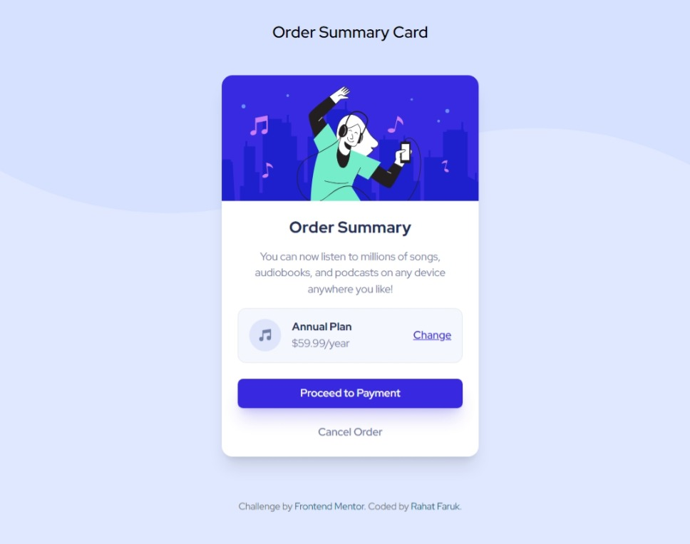

# Frontend Mentor - Order summary card solution

This is a solution to the [Order summary card challenge on Frontend Mentor](https://www.frontendmentor.io/challenges/order-summary-component-QlPmajDUj). Frontend Mentor challenges help you improve your coding skills by building realistic projects. 

## Table of contents

- [Overview](#overview)
  - [The challenge](#the-challenge)
  - [Screenshot](#screenshot)
  - [Links](#links)
- [My process](#my-process)
  - [Built with](#built-with)
  - [What I learned](#what-i-learned)
- [Author](#author)

## Overview

### The challenge

Users should be able to:

- See hover states for interactive elements

### Screenshot

 


### Links

- [source code - github](https://github.com/rahatfaruk/fm-order-summary-card)
- [live site](https://rahatfaruk.github.io/fm-order-summary-card)

## My process

### Built with

- Mobile-first workflow
- Semantic HTML5 markup
- Tailwind CSS
- Flexbox
- React.JS

### What I learned

-> Custom Background Image with Background Color: I displayed a custom background image (`bg-[url("/")]`) with the background color. To achieve better positioning, I utilized various background-image-related properties. Additionally, I displayed different background images for small and large screens.

```html
  <div className="bg-pale-blue bg-[url('/pattern-background-mobile.svg')] md:bg-[url('/pattern-background-desktop.svg')] bg-no-repeat bg-contain bg-top">
    <!-- order summary card -->
    <!-- attribution -->
  </div>
```

-> On hover, I changed the design by adjusting the color, background, and opacity as needed for the buttons. I also used transitions to ensure smooth changes.


## Author

- Portfolio - [Rahat Faruk](https://rahatfaruk.vercel.app)
- Linkedin - [@rahatfaruk](https://www.linkedin.com/in/rahatfaruk)
- dev.to - [@rahatfaruk](https://dev.to/rahatfaruk/)
- Frontend Mentor - [@rahatfaruk](https://www.frontendmentor.io/profile/rahatfaruk)